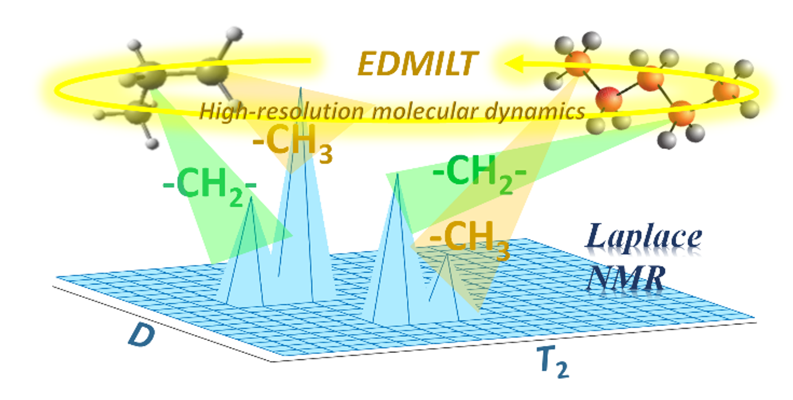

# EDMILT

EDMILT is proposed for multidimensional Inverse Laplace Transform of high-resolution NMR spectra by Enping Lin et al. 
If you use the code for any purpose, please cite the relateds papers:

   (1) Enping Lin, Ville-Veikko Telkki, Xiaoqing Lin, Chengda Huang, Haolin Zhan, Yu Yang*, Yuqing Huang*, and Zhong Chen*High-Resolution Reconstruction for Multidimensional Laplace NMR, J. Phys. Chem. Lett. 2021, 12, 21, 5085–5090.  https://doi.org/10.1021/acs.jpclett.1c01022
   
   (2) Kim, S. J.; Koh, K.; Lustig, M.; Gorinevsky, S. B. D., An Interior-Point Method for Large-Scale L1-Regularized Least Squares. IEEE Journal of Selected Topics in Signal Processing 2008, 1 (4), 606-617.

   
   

Contact: Enping Lin (林恩平) Ph.D. ： enpinglin@qq.com
